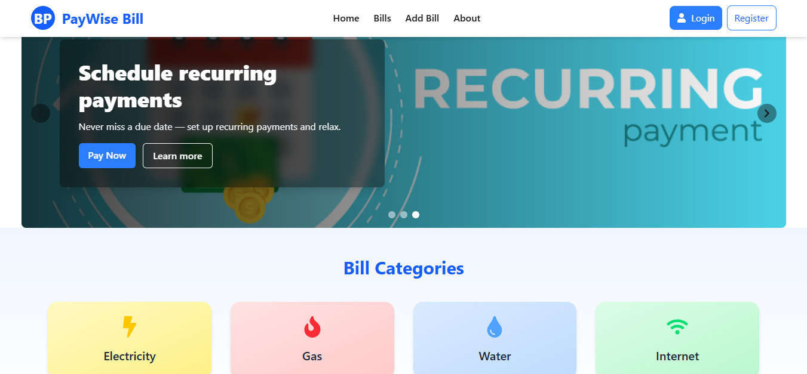

# Bill Management System (Client)

## 📌 Overview
This is a bill management system that helps users track, manage, and organize bills efficiently through a simple interface.

## 🔗 Live Link
https://bill-management-53f4a.web.app/

## 🖼 Screenshot

## 🛠 Technologies Used
- JavaScript
- HTML
- CSS
- react
- node

## ✨ Features
- Add and manage bills
- Simple and clean UI
- Easy bill tracking

## 📦 Dependencies
- react
- daisyui
- sweetaleart
- react-router
- tailwindcss

## ⚙️ How to Run Locally
1. Clone the repository
git clone https://github.com/prachi23chowdhury/bill-management-system-client.git
